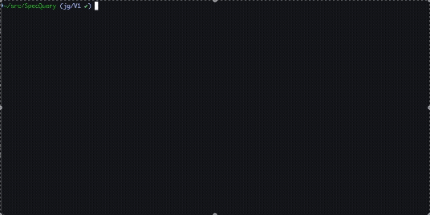

# SpecQuery



Generate fully-typed TanStack Query clients from OpenAPI v3 specifications. SpecQuery consumes a JSON or YAML schema and emits a ready-to-use React Query client with hooks, query keys, and invalidation helpers.

## Features
- ⚙️ CLI workflow that turns any OpenAPI v3 document into React Query hooks.
- 🧭 Strongly-typed path, query, and header parameters with safe interpolation.
- 🪝 Query + mutation hooks that share a generated API client.
- 🔁 Query key factory and invalidation helpers aligned with the emitted hooks.
- 📦 Programmatic API for integrating SpecQuery into custom build pipelines.

## Why SpecQuery?
- **Compared to hey-api**: SpecQuery focuses on TanStack Query hooks, not full-stack client scaffolding, so the generated code drops cleanly into existing React apps without extra runtime dependencies.
- **Compared to openapi-typescript**: Instead of just types, SpecQuery produces ready-to-use hooks and clients while still integrating with the types you already generate via `openapi-typescript`.
- **Compared to swagger-typescript-api**: Swagger TypeScript API is HTTP-client oriented; SpecQuery embraces React Query conventions (query keys, invalidation helpers, hook signatures) for stateful React apps.

## Requirements
- Node.js ≥ 18.18.
- An OpenAPI 3.x specification (JSON or YAML).
- The generated hooks expect `@tanstack/react-query` in your project.

## Install
```bash
npm install --save-dev spec-query
```
*Optional peer tooling*:
```bash
npm install --save-dev openapi-typescript   # Generate shared types
npm install @tanstack/react-query           # Required by generated hooks
```

## CLI Usage
```bash
npx spec-query \
  --schema ./openapi/petstore.yaml \
  --out ./src/api \
  --base-url https://api.example.com
```

### Options
| Flag | Description | Default |
| --- | --- | --- |
| `-s, --schema <pathOrUrl>` | OpenAPI schema path (local file or URL). | *required* |
| `-o, --out <dir>` | Output directory for generated files. | `examples/out` |
| `--base-url <url>` | Default base URL used by the generated client. | `/api` |
| `--generate-types` | Emit a lightweight helper `types.ts` file. | `false` |
| `--group-by-tag` / `--no-group-by-tag` | Emit one hook file per tag or a single file. | `true` |
| `--openapi-ts-config <path>` | Path to an `openapi-typescript` JSON config when you share types. | — |
| `--verbose` | Log each parsed operation to stdout. | `false` |
| `--dry-run` | Preview generated file paths without writing them. | `false` |

Run `npx spec-query --help` to see the full help output.

### Output
Depending on your options the following files are produced:
- `client.ts` – Fetch wrapper with error handling and retry scaffolding.
- `queryKeys.ts` – Strongly-typed query key factory.
- `invalidate.ts` – Convenience helpers for cache invalidation.
- `hooks/*.generated.ts` or `hooks.generated.ts` – Query/mutation hooks by tag.
- `types.ts` – Optional helper types scaffold (enabled via `--generate-types`).

## Programmatic API
`spec-query` also exports the generator so you can wire it into custom tooling:

```ts
import { generate } from "spec-query";

await generate({
  schema: "./openapi/petstore.yaml",
  outDir: "./src/api",
  baseUrl: "https://api.example.com",
  groupByTag: true,
  generateTypes: false,
});
```

All options mirror the CLI flags.

## Using openapi-typescript
If you already run [`openapi-typescript`](https://www.npmjs.com/package/openapi-typescript) you can share its output with SpecQuery. Create a small JSON file:

```json
{
  "typesPath": "./src/api/types.ts",
  "baseUrl": "https://api.example.com",
  "headers": {
    "Authorization": "Bearer {{token}}"
  }
}
```

Pass it to the CLI with `--openapi-ts-config`. SpecQuery will import the generated types inside the emitted client.

## Development
```bash
npm install           # install dependencies
npm run build         # produce dist output with tsup
npm test              # runs vitest with pass-through for no tests
```

## License
MIT © Jake Ganz
# SpecQuery
